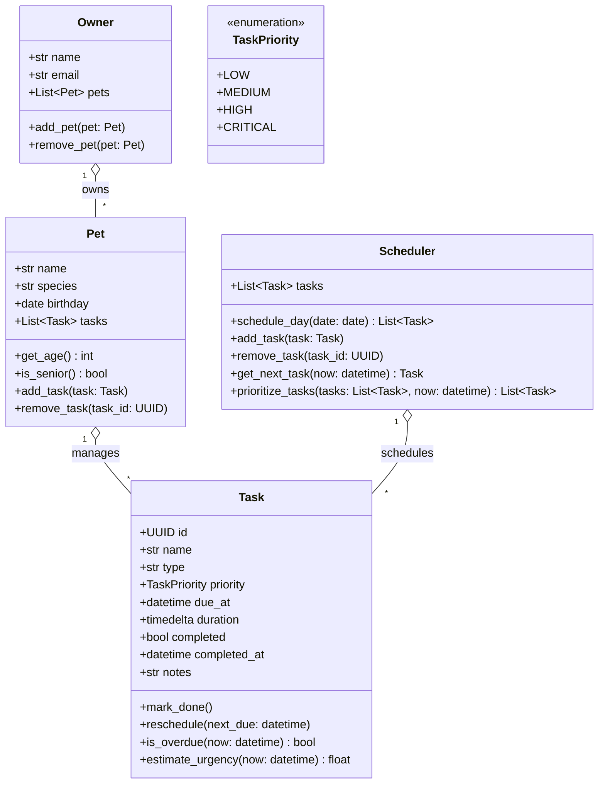

# PawPal+ UML Design

This document captures the high-level UML design for PawPal+, a smart pet care management system.

## Class Diagram (Mermaid)

## Class Relationships (Mapping to Python)

- **Owner → Pet**: An `Owner` can own multiple `Pet` instances. Pets live under their owner and are managed through the `Owner` class.
- **Pet → Task**: Each `Pet` maintains a list of `Task` objects. Tasks represent daily routines (feeding, walks, medication, appointments).
- **Scheduler → Task**: The `Scheduler` consumes a list of `Task` objects (often gathered from one or more pets) and produces a prioritized schedule.

---

## Notes

- This simplified design uses only **4 core classes**: **Owner**, **Pet**, **Task**, and **Scheduler**.
- Tasks are represented with a **generic `type` field** (e.g., "feeding", "walk", "medication", "appointment") to keep the model small while still allowing diverse behaviors in the scheduler.
- The scheduler focuses on daily priorities and due-dates, making this architecture easy to exercise via a CLI demo script.
